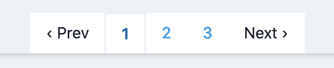
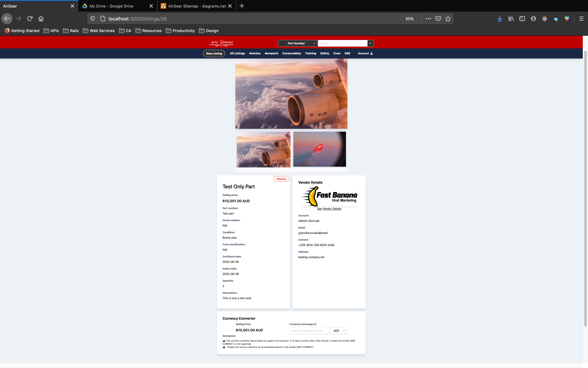
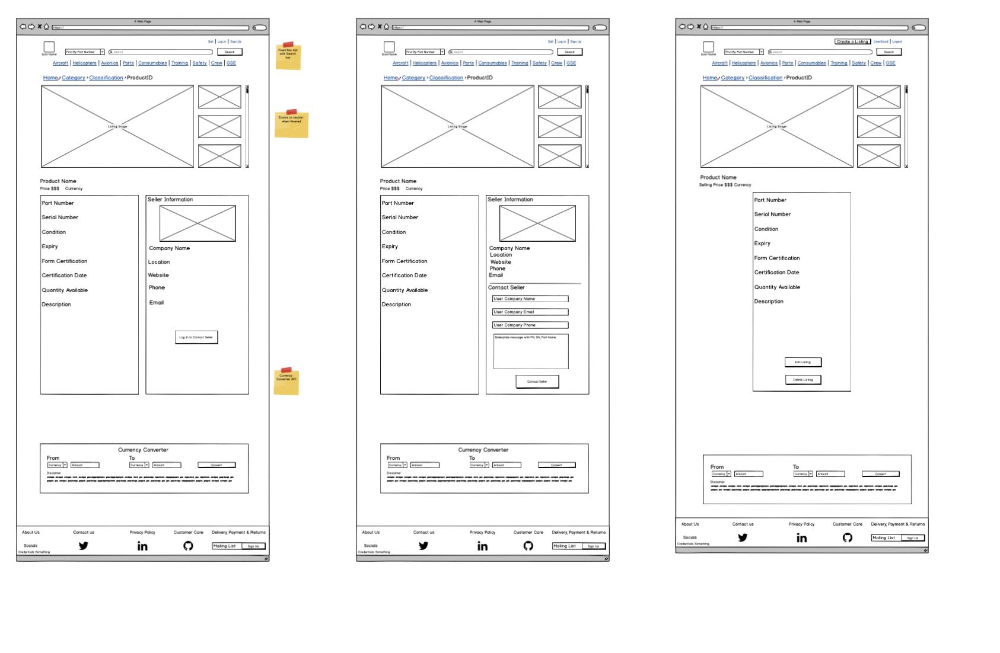

# AirGear Aerospace :airplane::earth_asia:

## _Your business' one stop solution to logistical aviation industry problem_

[Live Website](https://airgear-aerospace.herokuapp.com/)  
[Project Github Repo](https://github.com/philrussel21/AirGear-Aerospace-marketplace)  
[Trello project planning, task management and organization](https://trello.com/b/UBjlf9aK/airgear-aerospace-parts-webapp)

### The Problem :question:

During my time working on a local airline as a Logistic Officer, one of the major problems that I noticed and faced in the aviation industry is outsourcing its supply chains. Aicraft's raw materials alone are widely distributed in different regions around the globe which can be really challenging specially to airlines that does not have access to this market, thus resorting to a man-in-the-middle strategy. This strategy, although puts them in the market and eventually match their needs, usually comes with a hefty price; figuratively, literally and sometimes both. Delays, communication errors and insufficent information are the most common shortcoming from this strategy which often results to Aircraft's being on ground and maintenance being delayed.

I also noticed the downside of having decades-age aircrafts; limited to no new parts being manufactured. They then have to rely to other businesses' surplus who has the same fleet to be operational and their aircrafts certified to fly the skies.

### The Proposed Solution :mag:

This app aims to replace the man in the middle strategy using the biggest platform available to date: the world wide web. Using [AirGear Aerospace](https://airgear-aerospace.herokuapp.com/), businesses can talk directly to suppliers and other business about their aeropart needs. They can discuss pricing, priority (routine, rush or AoG), and the likes without the usual delay in communicating through a middle man, thus streamlining the process. Local airlines would also have access to a global range of products and services without a hefty price.

AirGear would also let other airlines post listings of their parts surplus accumulating extra income as well as helping the suffering airline industry as a whole.

### The App :package:

#### Purpose

The purpose of this app is to replace the man in the middle strategy by streamlining the communication and logistical process in the aviation industry. This app also takes advantage of the world wide web as a platform to give the industry access and means to other businesses from local to international. It also aims to reduce the waiting and delay times, full disclosure of part information and to reduce cost when obtaining aeroparts.

#### Functionality/ Features

-   **Search Feature**

    -   This app offers search functionality for users who knows what they need. Using the dropdown menu, users can search via part number or matching part name.
        

-   **Filter by Category**

    -   Filter by category was also made available in the navigation bar. Each category listed would take user to see all listings under the chosen category.
        

*   **Pagination**

    -   Limits the number of listings shown to user to better showcase listings. Gives users the ability to browse through pages.
        

-   **Profile Authentication**

    -   Users would be asked to create an account with their email and company name, existing users would be given an option to log in. After creation, users would be asked to fill their company details by uploading company logo or photo, company address, website and contact information. Users would also be able to keep track of their listings/postings by having them available in their profile.

    -   

*   **Authorisation**

    -   The app offers listing and profile security by implementing authorisation procedures to limit and prohibit access of invalid users. Account users would be the only ones to have the authority to edit their profiles and listings.
        

*   **Anonymity**

    -   Casual users who aims to browse through the app would be given access to see all listings, sort by category, and search the app for a certain part (using the part number or matching part name) without the need to sign in or sign up.

*   **Listing Highlights**

    -   The most recent listings are featured in the landing page. All listings page also sorts by having the most recent on top. Newly created listings as well as recently updated listings are also being highlighted to get user's attention and to promote the product.
    -   

*   **Multiple Images**

    -   When creating a listing, the seller can upload multiple photos of the part to better promote and market the product.
    -   

*   **Global Currency Support**

    -   When creating a listing, the seller would be given the option to choose the preferred currency of trade.
        

*   **Currency Conversion/Exchange Estimate**

    -   Users would have an option to take advantage of the Currency Conversion feature of the app that converts the listing's currency and selling price to the preferred currency to give the user the estimate cost. Exchange rate is based on eu_central_bank gem that reads published exchange rate from European Central Bank to produce the closest result.
        

-   **Aviation News Gallery**
    -   Users would be able to view news in the aviation industry from the recent week from most popular news sources. This aviation news gallery is available in the landing page and does include the link to the source as well as a brief introduction, source image and publish date. This feature is implemented to keep users up to date with the current news in the industry without leaving the app.
    -   The inspiration behind this feature is based on my experience working with aviation engineers and how they're always involved in the industry and its happenings.
        

#### Sitemap


#### Pages Screenshots

-   **Landing Page**
    

-   **Log in Page**
    

-   **Sign-up & Edit Account Page**
    

-   **Create and Edit Profile Page**
    

-   **Show Profile Page**
    

-   **All Listings Page**
    

-   **Filter by Category Page**
    

-   **Search Results Page**
    

-   **Show Listing Page**
    

-   **Create and Edit Listing Page**
    

#### Target audience

This app aims to provide services to local and international airline supplier and companies to have access to a wider range of market. Its goal is to streamline the process of communication from one business to another ideally reducing the logistical issues commonly present when using a man in the middle strategy. Listings being sold in this app would be both beneficial to commercial and private aircrafts.

Aircraft collectors and enthusiasts looking for aeroparts are also welcome to take advantage of this app.

#### Tech stack

-   **Ruby on Rails v6.0.3.2**
-   **Ruby**
-   **PostgreSQL**
-   **HTML**
-   **CSS**
-   **Javascript**
-   **Tailwind CSS Framework**
-   **Heroku**
-   **Amazon S3**

### User Stories :bookmark:

#### [Link to Trello board](https://trello.com/b/UBjlf9aK/airgear-aerospace-parts-webapp)


### Wireframes :clipboard:

-   **Landing Page**
    
-   **Login**
    
-   **Create and Edit Account**
    
-   **Show Profile**
    
-   **All Listings**
    
-   **Create and Edit Listing**
    
-   **Show Listing**
    

### Entity Relationship Diagram :file_folder:

#### [Link to dbdiagram](https://dbdiagram.io/d/5f0ff2f174ca2227330d6ad2)


### High-level components (abstractions) in the app :scroll:

#### Search and Filter Component

The app allows users to search and filter through listings in accordance to their preference. This component reduces the need to sort through tens to hundreds of records looking for a particular listing, or a particular category. In addition, the app also supports the ability to sort and jump through pages of listings.

#### Authentication and Authorisation component

Casual users randomly browsing to look at listings would not be asked to sign in or sign up, with limitations. Existing users are the only ones allowed to create listings and view other user's profile. However, the account owner is the only user authorised to make changes to own listings and profile.

#### Aviation Industry News

Provides users top news from the recent week and are updated daily from popular news sources. Link to sources are provided.

#### Global Market

Aims to cater the aviation industry on a global scale by offering sellers an option to choose and set the currency of their listing.

Estimate figures in different currencies from notable and reputable global bank exchange rate provider is made available to potential buyers and interested parties.

#### Listing Highlights/Badges

Highlights newly created listings and recently updated listings to attract attention and distinguish from other listings.

#### Responsive Grid Presentation

Responsive app that caters to users with different screen width and device preference. Grid presentation for better user experience and user interface.

#### Direct Link to Google Maps

The full address shown under user profile directly link a query to google maps to show map location.

#### Part Full Disclosure

All relevant information about an aircraft part is readily available to viewers specially potential buyers including multiple image upload for initial visual inspection for interested parties.

### Third Party Services Used :paperclips:

-   [**Amazon S3**](https://aws.amazon.com/s3/)

    -   Along with active storage, Amazon S3 by Amazon Web Services was used as an object storage through a web service interface. It's services was used to store and retrieve images that have been uploaded through the app.

-   [**Heroku**](https://www.heroku.com/)

    -   Heroku is a cloud platform as a service supporting several programming languages, including Ruby, that enables developers to build, run, and operate applications. This application was used as the deployment location to host the live web app in the production environment.

-   [**News-API**](https://newsapi.org/)

    -   A simple HTTP REST API for searching and retrieving live articles from all over the web. It is being used as the source of the Aviation News Gallery in the landing page. It was further customized to sort through the news for any aviation-related content, sorted via popular sources.

-   [**Tailwind**](https://tailwindcss.com/)
    -   A low level but highly customizable CSS framework that focuses on utility classes that lets users build custom designs according to preference. Its highly customizable ability makes it stand out over other frameworks to have a unique looking website. This framework was used to produce a distinctive website without sacrificing the basic UI/UX ideologies.

#### Gems Used

-   **Active Storage**

    -   Used with Amazon S3 to facilitate uploading files to a cloud storage. Recently been merged into Rails but uninitialized by default.

-   **Devise**

    -   A flexible and customizeable ruby gem to handle user authentication. This gem was customised and used to reflect the app's needs without sacrificing security.

-   **Country Select Gem**

    -   A ruby gem that provides a simple helper to get an HTML select list of countries using the ISO 3166-1 standard. This gem was used to offer a selection of countries for user accounts when creating a profile.

-   **Money**

    -   A Ruby gem library for dealing with money and currency conversion. It represents monetary values as integers, in cents to produce the most accurate results. This gem was used with eu_central_bank gem to implement the currency conversion feature within the app.

-   **EU Central Bank Gem**

    -   Ruby gem that downloads exchange rates from the European Central Bank. The exchange rates are updated daily to arrive with the most accurate result. Used along with the money gem to implement the currency conversion feature within the app.

-   **Currencies Gem**

    -   Ruby gem that contains every currency in the ISO 4217 standards. Used within the app to populate the currency select tag option in the create a listing page.

-   **Pagy gem**

    -   Labeled as the ultimate pagination gem to handle the number of listings shown to the user and to provide pagination feature (jump through different pages). Used to replace Active Record helpers `#limit()` and `#offset()` without the need of complex mathematical calculations.

-   **Stimulus Reflex**

    -   A library for creating realtime, reactive apps in Rails without the complex use of Javascript. It keeps track of the action that was used to render the views and uses websockets to re-render the certain view. This gem is primarily used to implement the Currency Exchange feature to deliver real time output to users.

-   **Faker Gem**
    -   A ruby gem that generates fake data to be used as a placeholder in common web apps. This gem was used to populate the database with fake user data to be used in the development phase of the app.

## Database Structure

### The Models and its relations :briefcase:

-   **Account**
    -   The model used in implementation with the devise gem. In addition to the default behaviours provided by devise, Company Name attribute was added as a requirement to empahsize on the target audience (companies and businesses). The relationships and associations of this model is as follow:
        -   **Has one Profile**
        -   **Has many Listings**
-   **Profile**
    -   The model used to gather more information from the user to set up profile. This model was seperately set up from the Account model to minimise hand over to devise and to have more control over the user attributes. This table consists the business' contact information, namely address, website and contact number with the hopes of connecting interested parties with one another. The relationships and associations of this model is as follow:
        -   **Has one Account**
        -   **Has one picture attached**
-   **Listing**
    -   The model used to store all the information and attributes of a Listing. This table's attributes aim to provide full disclosure of the product in order to supply potential buyers the necessary product requirements they look for. The relationships and associations of this model is as follow:
        -   **belongs to Account**
        -   **belongs to Category**
        -   **Has many picture attached**
-   **Category**
    -   The model used to categorize Listings. Setting this table up takes full control of categories available in the app and makes filtering the listings by category easy.
        -   **Has many Listings**

### The Schema

```ruby
ActiveRecord::Schema.define(version: 2020_07_29_055443) do

  # These are extensions that must be enabled in order to support this database
  enable_extension "plpgsql"

  create_table "accounts", force: :cascade do |t|
    t.string "email", default: "", null: false
    t.string "encrypted_password", default: "", null: false
    t.string "company_name", default: "", null: false
    t.string "reset_password_token"
    t.datetime "reset_password_sent_at"
    t.datetime "remember_created_at"
    t.datetime "created_at", precision: 6, null: false
    t.datetime "updated_at", precision: 6, null: false
    t.index ["email"], name: "index_accounts_on_email", unique: true
    t.index ["reset_password_token"], name: "index_accounts_on_reset_password_token", unique: true
  end

  create_table "active_storage_attachments", force: :cascade do |t|
    t.string "name", null: false
    t.string "record_type", null: false
    t.bigint "record_id", null: false
    t.bigint "blob_id", null: false
    t.datetime "created_at", null: false
    t.index ["blob_id"], name: "index_active_storage_attachments_on_blob_id"
    t.index ["record_type", "record_id", "name", "blob_id"], name: "index_active_storage_attachments_uniqueness", unique: true
  end

  create_table "active_storage_blobs", force: :cascade do |t|
    t.string "key", null: false
    t.string "filename", null: false
    t.string "content_type"
    t.text "metadata"
    t.bigint "byte_size", null: false
    t.string "checksum", null: false
    t.datetime "created_at", null: false
    t.index ["key"], name: "index_active_storage_blobs_on_key", unique: true
  end

  create_table "categories", force: :cascade do |t|
    t.string "name"
    t.datetime "created_at", precision: 6, null: false
    t.datetime "updated_at", precision: 6, null: false
  end

  create_table "listings", force: :cascade do |t|
    t.bigint "category_id", null: false
    t.bigint "account_id", null: false
    t.string "part_num"
    t.string "part_name"
    t.float "selling_price"
    t.string "currency"
    t.string "serial_num"
    t.integer "condition"
    t.string "form_cert"
    t.date "cert_date"
    t.date "expiry_date"
    t.integer "quantity"
    t.text "description"
    t.datetime "created_at", precision: 6, null: false
    t.datetime "updated_at", precision: 6, null: false
    t.index ["account_id"], name: "index_listings_on_account_id"
    t.index ["category_id"], name: "index_listings_on_category_id"
  end

  create_table "profiles", force: :cascade do |t|
    t.string "country"
    t.string "street"
    t.string "suburb"
    t.string "state"
    t.string "postcode"
    t.string "website"
    t.string "contact"
    t.bigint "account_id", null: false
    t.datetime "created_at", precision: 6, null: false
    t.datetime "updated_at", precision: 6, null: false
    t.index ["account_id"], name: "index_profiles_on_account_id"
  end

  add_foreign_key "active_storage_attachments", "active_storage_blobs", column: "blob_id"
  add_foreign_key "listings", "accounts"
  add_foreign_key "listings", "categories"
  add_foreign_key "profiles", "accounts"
end

```


## Task Allocation :pushpin:

[Link to Trello](https://trello.com/b/UBjlf9aK/airgear-aerospace-parts-webapp)


Trello Board has been used to allocate tasks and track the progress of the app. In addition, ideas, features, resources and user stories were also put in the board to make it all available in one place.

As a good practice, I have set up a daily devlog to track my daily progress and tasks.

[Daily Devlog](./public/docs/devlog.md)

## Testing :warning:

Manual testing was the only testing implemented on this app due to limited knowledge on the concept and the time allocated into building this app. Below are the categories as to where manual testing were commonly made.

-   **Data Structure**

    -   Understanding what happens under the hood when generating `scaffold`
    -   How data and its attributes are being passed from one element, method or file to another either through routes.
    -   Accessing data and its attributes using its relationships and associations.
    -   Accessing data using the values passed in the url.
    -   Comparing number of queries with and without eager loading resulting to a more optimized application.
    -   Experimenting in the `rails console` before running lines of code that would affect the database records.
    -   Multiple image upload feature test
    -   Implementation of Stimulus Reflex with other ruby gems to make currency converting real time

-   **Data Presentation**

    -   Testing the implementation of using `enums`
    -   Rendering different partials and moving chunks of code from `file.html.erb` to partials for DRYer code.
    -   Implementation of pagy gem for pagination feature

-   **Design**

    -   Testing Tailwind designs on different screen width to make it responsive
    -   Design testings in general with Tailwind used as a CSS framework

-   **General**
    -   Deployment Testings and compatibility issues particularly with Amazon S3 and Heroku

## Copyright :white_check_mark:

MIT License

Copyright (c) 2020 Phil Antiporda

Permission is hereby granted, free of charge, to any person obtaining a copy of this software and associated documentation files (the "Software"), to deal in the Software without restriction, including without limitation the rights to use, copy, modify, merge, publish, distribute, sublicense, and/or sell copies of the Software, and to permit persons to whom the Software is furnished to do so, subject to the following conditions:

The above copyright notice and this permission notice shall be included in all copies or substantial portions of the Software.

THE SOFTWARE IS PROVIDED "AS IS", WITHOUT WARRANTY OF ANY KIND, EXPRESS OR IMPLIED, INCLUDING BUT NOT LIMITED TO THE WARRANTIES OF MERCHANTABILITY, FITNESS FOR A PARTICULAR PURPOSE AND NONINFRINGEMENT. IN NO EVENT SHALL THE AUTHORS OR COPYRIGHT HOLDERS BE LIABLE FOR ANY CLAIM, DAMAGES OR OTHER LIABILITY, WHETHER IN AN ACTION OF CONTRACT, TORT OR OTHERWISE, ARISING FROM, OUT OF OR IN CONNECTION WITH THE SOFTWARE OR THE USE OR OTHER DEALINGS IN THE SOFTWARE.
